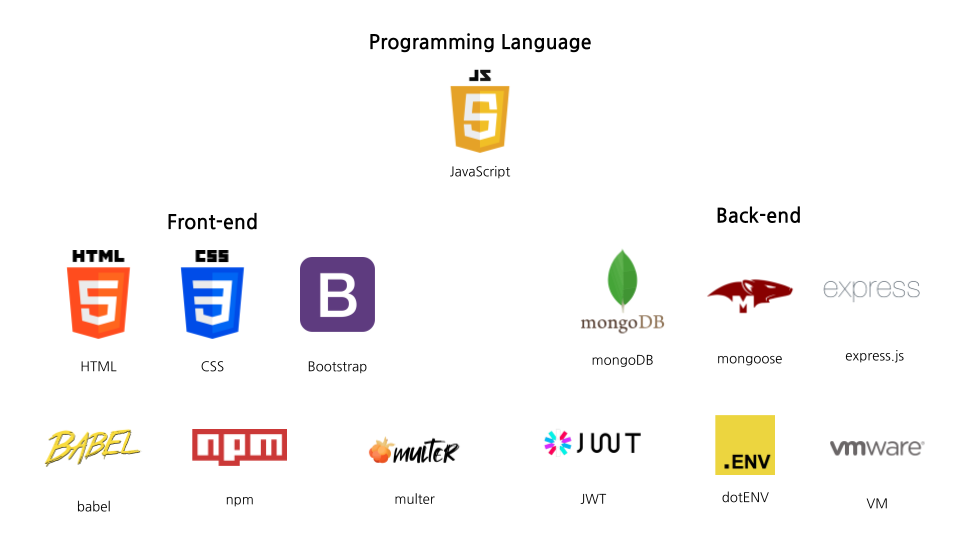

## [Team 13] Elice House

### 🤗 팀원 소개

| 팀원명 | 역할     | 담당부분                                                                                                                                                                                         |
| ------ | -------- | ------------------------------------------------------------------------------------------------------------------------------------------------------------------------------------------------ |
| 양유진 | 팀장, FE | - 와이어프레임, 스토리보드 제작 - 데일리 스크럼 작성 - 페이지: register, login - 컴포넌트: header-menu - README 작성                                                                 |
| 김라온 | FE       | - 와이어프레임 피그마 - 컴포넌트: footer, header-category, item-card, menu-bar - 페이지: main, order-cart, order-complete, order-complete                                                  |
| 김래희 | FE       | - 컴포넌트: my-nav - 페이지: my-order, my-info                                                                                                                                                |
| 안성빈 | FE       | - 컴포넌트: admin-nav - 페이지: admin-main, admin-order, admin-category, admin-product                                                                                                        |
| 강성관 | BE       | - 카테고리 스키마 및 모델 구현, rest API 설계 및 CRUD 기능 구현 - '상품' 제외한 조회(GET) 및 생성(POST) 구현 - VM 서버 활용 배포 - MongoDB 한국시간대 추가                              |
| 곽수경 | BE       | - 상품 스키마 및 모델 구현, 상품 rest API 설계 및 CRUD 기능 구현 - '카테고리' 제외한 업데이트(PATCH) 기능 구현 - middleware 구현 - jwt 토큰 활용 로그인 인증 구현 - multer 기능 구현 |

##  

 

### 📡 VM <배포용 IP주소> \_\_ (링크, 테스트 계정 생성 필수)

- 배포용 IP 주소
  kdt-sw-5-team13.elicecoding.com

- 테스트 계정
  - ID:
  - PW:

##  

 

### 🔎 서비스 소개 및 기능 (with 이미지)

#### 🏡 프로젝트 서비스 소개

모두가 편히 휴식을 취할 수 있는 자신의 공간,
엘리스 하우스는 바쁜 일상 속 그 소중한 공간을
보다 효율적이고 실용적인 공간으로 꾸리는 데에 도움을 드리고자 합니다.

#### 🛠 기술 스택

 

#### ⚙️ 각 기능 간단 소개

##  

 

### 🚀 트러블 슈팅

**- API 404 에러**

- **문제** 라우터, api 파일 작성 등 파일 자체에는 에러가 보이지 않지만, 웹 브라우저에서 확인해보면 `GET httmp://localhost:PORT번호/utils/api 404 (Not Found)` 에러와 함께 api 호출이 정상적으로 이루어지지 않는 문제
- **해결과정** 간단하게 요약하면 api파일 경로 문제였습니다. resourcePath 변수에 작성한 파일 경로 기준으로만 접근가능하다는 점과 app.js 파일에서 `app.use("/api", 라우터명)`으로 작성했던 내용에서 api 파일이 필요한 곳에 접근할 수 없는 것이 원인이었습니다. 따라서 1차적으로 "api.js" 파일을 "apiUtils.js"로 파일명을 변경하고, 2차적으로 기준점인 resourcePath에 작성된 파일 경로에 "apiUtils.js" 파일을 이동하여 정상적으로 api 호출이 가능토록 해결하였습니다.

##  

 

### 👀 실제 동작 시연 (직접 시연)
